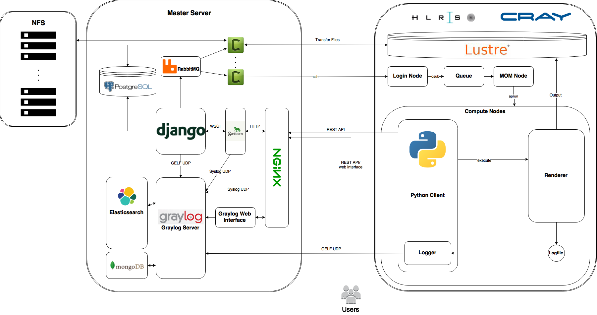

========
Overview
========

This is an Ansible_ Playbook designed for running a Raycrafter_ Master Server.
It installs and configures applications that are needed for production deployments.

It deploys a Django_ project and sets up Gunicorn_ and Nginx_ to serve your site.
PostgreSQL_ is used as database backend for Django_.
Celery_ (with RabbitMQ_ as message broker) for asynchronous task queue/job queue.

On top of that a logging server is deployed. In this case it is Graylog_, which depends
on Elasticsearch_ and MongoDB_.

Stack:

- Nginx_
- Gunicorn_
- PostgreSQL_
- Supervisor_
- Virtualenv_
- Memcached_
- Celery_
- RabbitMQ_
- Elasticsearch_
- MongoDB_
- Graylog_ Server/Web Interface

**Tested with OS:** Ubuntu 14.04 LTS x64

.. _Nginx: http://nginx.org/
.. _Gunicorn: http://gunicorn.org/
.. _PostgreSQL: http://www.postgresql.org/
.. _Supervisor: http://supervisord.org/
.. _Virtualenv: https://virtualenv.pypa.io/en/latest/
.. _Memcached: http://memcached.org/
.. _Celery: http://www.celeryproject.org/
.. _RabbitMQ: https://www.rabbitmq.com/
.. _Elasticsearch: https://www.elastic.co/products/elasticsearch
.. _MongoDB: https://www.mongodb.org/
.. _Graylog: https://www.graylog.org/
.. _VirtualBox: https://virtualbox.org/
.. _Vagrant: https://vagrantup.com/
.. _Ansible: http://www.ansible.com/
.. _Raycrafter: https://github.com/RayCrafter/
.. _Django: https://www.djangoproject.com/

------------
Architecture
------------

This graph shows the interaction between ``Master Server`` and the ``Cray XC40 'Hornet'``.

Django_ has most of the business logic on the server side. It is served with Gunicorn_ and Nginx_.
You can add new jobs or query information via a REST API.

When the user submits a new job to Django_, the job is stored in the PostgreSQL_ database. Because submitting jobs to the cluster takes long, the work is pushed to Celery_ workers.
The workers ssh onto the cluster to submit jobs, or transfer input and output data.
Django_ uses a message broker (RabbitMQ_) to send tasks to Celery_. The results of the tasks are stored in the database.

Submitting a job to the cluster works by logging onto the cluster via ssh and executing the ``qsub`` command.
The job stays in a Queue until a ``MOM node`` processess it. ``aprun`` executes a programm on the ``compute nodes``.

On the compute nodes, a Python client is started. The client asks Django_ what job it should render and then executes the renderer. The output of the renderer can be transfered back by Celery_ workers.

All logs are aggregated by a Graylog_ server. The Python client on the cluster inspects the logs of the renderer and sends them back.
Graylog_ also has a web interface, where you can create metrics and dashboards to quickly inspect the status of the jobs and servers.
Logs are processed and indexed by Elasticsearch_. MongoDB_ is used for some metadata by Graylog_.

-------------------
Usage in Production
-------------------

There are some important things to note and do before using this project in production.
The current development status is more of a proove of concept.

++++++++
Security
++++++++

**The current setup is insecure!** I'm not a security expert. Let a professional check your setup. Submit improvements via pull requests or issues for extra kudos.

Some hints for where to look:

- All default passwords and keys should be changed and encrypted!
- Make sure that your firewall limits access. Especially to your logging inputs!
  There is no authentication for these inputs right now.
- Check Nginx_ ssl settings. Use TLS and strong cipher suites.
- Check that no unnecessary ports are available to the public.
- Use encryption for all communications with the outside world.
  For now Graylog_ UDP inputs are not encrypted!
- Check how your passwords are stored in Django_ and in the Graylog_ database.
  Use strong salt and slow hash algorithms.

+++++++++++
Performance
+++++++++++

The server might get very slow. A lot of the software is meant be used in distributed systems.
A single machine might not be able to handle the workload. Especially the logging server might need a lot of conifguration and might need to be distributed.

Nginx_ and Gunicorn_ settings are important for the performance of the website and REST API.
The default settings are not optimal.

Check the Celery_ worker amount and settings. You might need more of them.

+++++++++++
Reliability
+++++++++++

Some services are not yet monitored by Supervisor_. Also you can configure more programms to log to the logging server.
